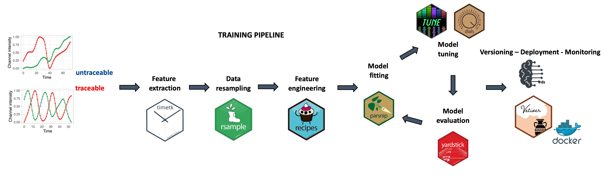
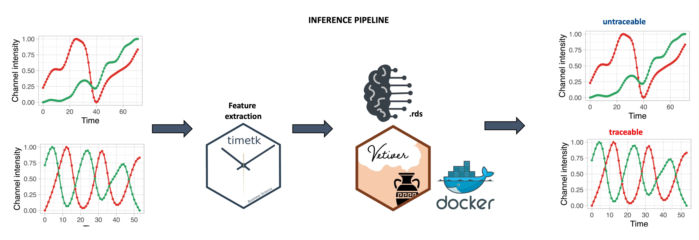

# [Automated workflow for the cell cycle analysis of (non-)adherent cells using a machine learning approach]()

*Kourosh Hayatigolkhatmi\^, Chiara Soriani\^, Emanuel Soda\^, Elena Ceccacci, Oualid El Menna, Sebastiano Peri, Ivan Negrelli, Giacomo Bertolini, Gian Martino Franchi, Roberta Carbone, Saverio Minucci, Simona Rodighiero*

\^Contributed equally

# Model Creation

The pipeline is created using the [`tidymodels`](https://www.tidymodels.org/) framework. The random forest model trained and stored as docker container can be found [here](https://hub.docker.com/repository/docker/emanuelsoda/rf_semi_sup/general) .

The .rds file can be found here



# Inference



```         

rf_model_quality <- 
  readr::read_rds("models/rf_model_semi_supervised0.9.rds")
  
parsnip::augment(rf_model_quality, tsfeature_tbl)
```
