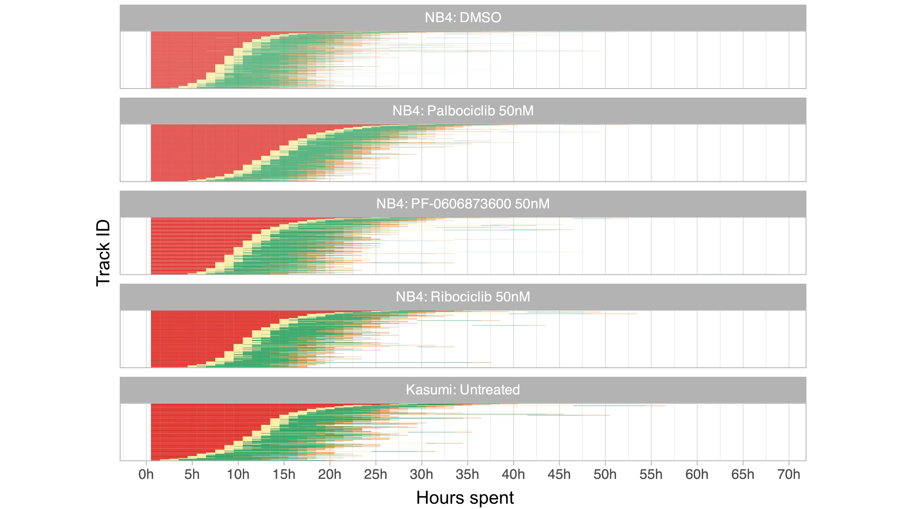
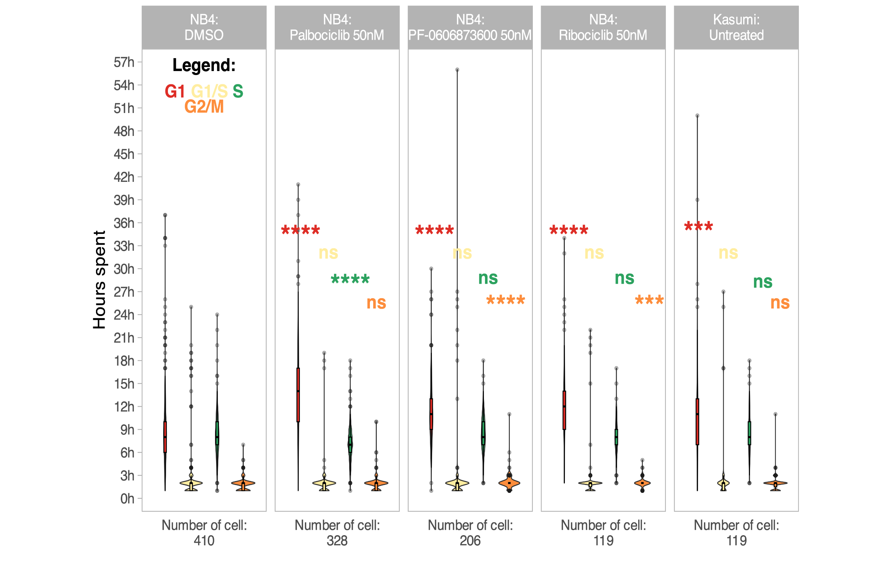

# [Automated workflow for the cell cycle analysis of (non-)adherent cells using a machine learning approach]()

***Kourosh Hayatigolkhatmi**, **Chiara Soriani**, **Emanuel Soda**, Elena Ceccacci, Oualid El Menna, Sebastiano Peri, Ivan Negrelli, Giacomo Bertolini, Gian Martino Franchi, Roberta Carbone, Saverio Minucci, Simona Rodighiero*

# Pipeline overview

## 0. Model Creation

The pipeline is created using the [tidymodels](https://www.tidymodels.org/) framework. The random forest model trained and stored as docker container can be found [here](https://hub.docker.com/repository/docker/emanuelsoda/rf_semi_sup/general) .

The model stored as `.rds` file can be found here


## 1. Inference


After training the model, making predictions is straightforward. Simply load the trained model and utilize either the `parsnip::predict()` function or, alternatively, `parsnip::augment()`. The latter not only provides predictions but also includes the associated predicted probabilities.

```         
rf_model_quality <- 
  readr::read_rds("models/rf_model_semi_supervised0.9.rds")
  
parsnip::augment(rf_model_quality, tsfeature_tbl)
```

## 2. Phase assignment

The normalized HUE intensity value for cycling cells serves as a basis for assigning the cell cycle phase according to the FUCCI construct. Various threshold values can be employed, but based on empirical testing, we recommend considering the following threshold:

| **Phase** | **Lower threshold** | **Upper threshold** |
|-----------|---------------------|---------------------|
| G1        | 0                   | 0.65                |
| G2/M      | 0.65                | 0.85                |
| S         | 0.85                | 1                   |

Assigning the cell cycle phase to the tracks that have passed the filter is straightforward, involving the addition of a new column to the table. This can be achieved, for example, using `dplyr::mutate()` and `dplyr::case_when()` as follows:

```         
data_table <- data_table %>%  
  dplyr::mutate(phase = dplyr::case_when(
    HUE >= 0 & HUE < 0.65 ~ "G1",
    HUE >= 0.65 & HUE <= 0.85 ~ "G2/M",
    HUE >= 0.85 ~ "S"
  ))
```

## 3. Result

The filtered tracks offer a valuable avenue for assessing differences among treatments. Specifically, by enumerating the number of frames each cell persists in a given phase and then dividing by the number of acquisitions per hour, we can compute the time spent (in hours) in each phase for each experimental condition. The subsequent plots depict the time spent in each phase for individual cells across various conditions




